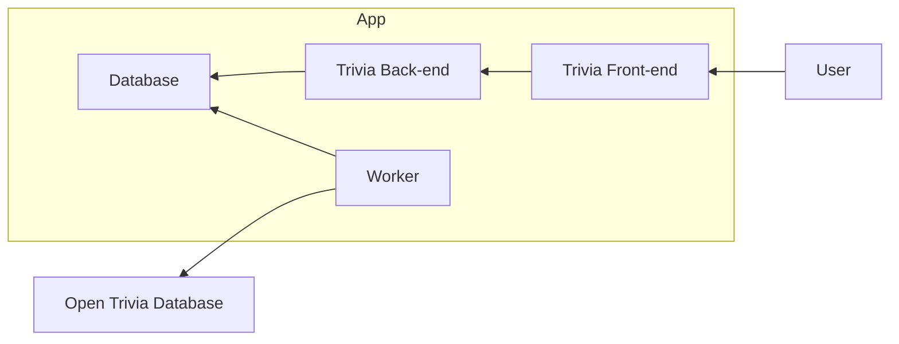

# Trivia App

Decisions made during the implementation of the service are documented using Architectural Decisions Records in [`docs/ADRs.md`](./docs/ADRs.md)

## Instructions

This repo uses .NET Aspire to orchestrate the services in the application.

Use the following docs to install what you need:

- .NET SDK 10.0: https://dotnet.microsoft.com/en-us/download
  - https://learn.microsoft.com/en-us/dotnet/core/install/windows
  - https://learn.microsoft.com/en-us/dotnet/core/install/linux
- .NET Aspire setup:https://aspire.dev/get-started/install-cli/
- Docker Desktop/Engine (for PostgreSQL and other containers): https://docs.docker.com/get-docker/
- Node.js + npm (for the frontend): https://nodejs.org/en/download/

## Run

Once those are installed, you should be able to run `dotnet aspire run` in the root of this repository, which will open a dashboard.

The worker seeds the database on startup. Until it finishes, `/api/questions` may return fewer results.

## Important API endpoints

- `GET /api/categories` - Lists available categories.
- `GET /api/questions?count={count}&categoryId={categoryId}` - Returns random questions without answers.
- `POST /api/questions/verify` - Verifies a selected answer.

## Tests

Run all tests:

```
dotnet test
```

End-to-end tests use Playwright. After the first build, install browsers with:

```
pwsh test/TriviaApp.Tests.EndToEnd/bin/Debug/net10.0/playwright.ps1 install
```

You need powershell even on Linux/Mac, because Microsoft...

## Architecture Overview



## Developing

Enable the local pre-commit hook to keep formatting consistent:

```
git config core.hooksPath .githooks
```
