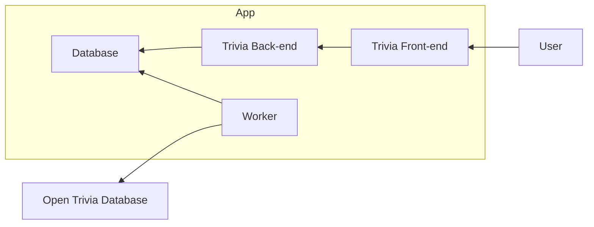

# Architectural Decision Records

Decisions made during the implementation of the service are documented here, to show my way of working/thinking.

## 00. Goal

Create a web api + front-end that allows users to answer trivia questions.

The trivia questions come from the Open Trivia Database (OTD), which provides a JSON API.

Hard requirements:

- API does not expose answers to the UI
- Front-end does not communicate with OTD directly

## 01. Intended solution

The [Open Trivia API](open-trivia-integration.md) is not super ergonomic to use for a stateless API.

It has a rate limit of 5 seconds per IP and no way of retrieving information for a specific question (there is no ID per question).

Assuming a multi-user scenario, we'd constantly run into rate limits any time 2+ users use the web app at the same time, if we'd call the API directly for every request made by the web apps.

This means we'd have to either keep state in the API or in an external store.

Personally, I'm not a big fan of stateful APIs, as it makes scaling up/down to multiple instances harder (either requiring sticky sessions or breaking the app).

Instead, I want to have a copy of the data I can access without rate limits that is stored outside of my instance state.

For this reason I am choosing to implement a background worker to pre-fetch data before a user even requests it.

This worker can put questions in a database with an identifier, allowing easier retrieval for validation by the API.

This solves both pain points: rate limits and retrieving specific questions.

The API can use the database as a source of truth using a read-only connection.

### High Level Flow



## 02. Tech stack

For the back-end I'm going to use .NET 10 with ASP.NET Core, as I'm the most familiar with it.

For the worker I'll use .NET 10 as well, but using the [Worker SDK](https://learn.microsoft.com/en-us/aspnet/core/fundamentals/host/hosted-services?view=aspnetcore-10.0) which creates a hosted service instead of an API.

For the front-end I'm going to use React, as it's the front-end framework I'm the most familiar with. I doubted between that, Blazor and HTMX, but for those other 2 I don't have too much experience and I don't want to spend too much time on the front-end.

To host all of this, I'm going to use [Aspire](https://aspire.dev/) as it makes orchestrating multiple sub projects much easier for both development and production. While hosting this in the cloud is out of scope for me, Aspire would make that trivial.

## 03. Test strategy

Given the scope and timebox, I'm limiting the automated tests to 3 projects that each cover a distinct risk:

- End-to-end tests: validate the primary user flow across UI + API using Aspire Testing + Playwright. The Worker is excluded and the API uses mock data so tests stay deterministic and never call OTD.
- API integration tests: validate endpoints work as expected.
- Worker integration tests: validate ingestion + persistence using mocked OTD responses and Testcontainers for the database.
- Domain unit tests: validate business rules in isolation.

## 04. Formatting and linting

To keep code style consistent, I'm using formatters/linters that automatically run. This way I don't have to think about it.

- C# uses EditorConfig + .NET analyzers with `dotnet format` for formatting and code-style checks.
- TypeScript uses ESLint for both linting and formatting.
- VS Code is configured to format on save and apply ESLint fixes.
- A pre-commit that is set up using `git config core.hooksPath .githooks`.

## 05. Front End

To help me with the front-end, I used Mantine for components and SWR + Zod for data fetching.

This mainly cuts down on the amount of boilerplate, none of what it's doing isn't something I could have written myself in "plain" React/TypeScript.

At some point I had a lot of `useState` everywhere to deal with which step of the quiz the user was on, etc. I put all of that in a [context and reducer](../frontend/src/state/quiz-context.ts) to encapsulate the state changes.

## Things I'm leaving out of scope

I only have limited time to work on this project, not multiple sprints. To prevent over-engineering a toy example, these are the things I left out of scope but I would likely implement for a **production-ready** version.

### CI / CD

- GitHub actions / Azure DevOps could run checks on each PR
- [Aspire](https://aspire.dev/) could create manifests for cloud providers like [Azure](https://aspire.dev/integrations/cloud/azure/overview/) or [AWS](https://docs.aws.amazon.com/sdk-for-net/v3/developer-guide/aspire-integrations.html), instead of just using the dev server

### Web App

- (User) Authentication
    - Not trivial to implement well, but less interesting for this exercise
    - Could be supported by persisting accounts to the database
    - Since all the endpoints are publicly available and usable (no Admin only endpoints, etc.) authentication is not a must for security reasons.
- Rate limiting
    - Abuse would be possible by hammering the API with expensive requests
- Caching
    - In higher traffic multi-user scenarios I would add caching on most queries (e.g. question by ID, first `n` questions of a category, etc.) or full responses (using [output caching](https://learn.microsoft.com/en-us/aspnet/core/performance/caching/output?view=aspnetcore-10.0))

### Worker

- Full copy
    - Since this is just a toy project, I stop processing _per category_ questions after a configurable amount of questions to reduce pressure on the Open Trivia Database
- Horizontal scaling
    - Workers could be sharded per category to process quicker
- Incremental update of data
    - On restart, the worker will remove all the data and process the Trivia DB fully again
    - We could check with hashes which questions are and aren't in the DB already, keeping track of a version and deleting any records with only old versions after it's done processing
        - We always need to fully process the Trivia DB because sessions are only kept for 6 hours


### User Experience

- Questions already answered by a user are not tracked
    - This could lead to duplicate questions
    - This could be tracked on the client-side tracking IDs already answered in a `Set`, new questions would have to be queried when already answered questions would be returned by the API.
    - If we had users, this could be tracked in the DB and also taken into account when querying new questions (e.g. `OUTER JOIN`-ing on `answers` for a specific `user`)

        ```postgres
        SELECT *
        FROM questions
        LEFT JOIN answers ON answers.question_id = questions.question_id
        WHERE answers.user = $USER_ID AND
              -- Left join results in NULL if not present
              answer.result IS NULL
        LIMIT $QUESTION_LIMIT;
        ```
- Setting difficulty
  - Relatively trivial to add, just like Category filtering
